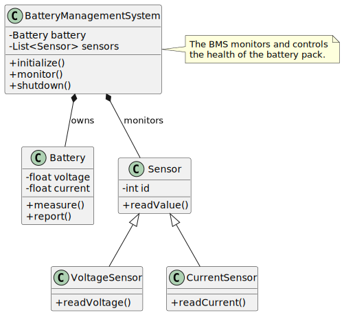

# LTC6810 Driver Library

A C++ library that abstracts the communication and management of the **LTC6810** chip from Analog Devices, designed to be **independent of the microcontroller (MCU)** used.

> **IMPORTANT** This library is yet on early development!

## 📚 Overview

This library provides a clean and flexible interface to interact with the LTC6810 chip, enabling cell voltage measurements and communication management in battery systems.  
It is designed to be platform-independent, making it easy to integrate into different environments and microcontrollers.

## ✨ Features

- Read cell voltages at a selected frequency
- Read up to 4 custom variables connected to LTC6810 GPIOs at a selected frequency

## 🚀 Getting Started

TODO

## Test

